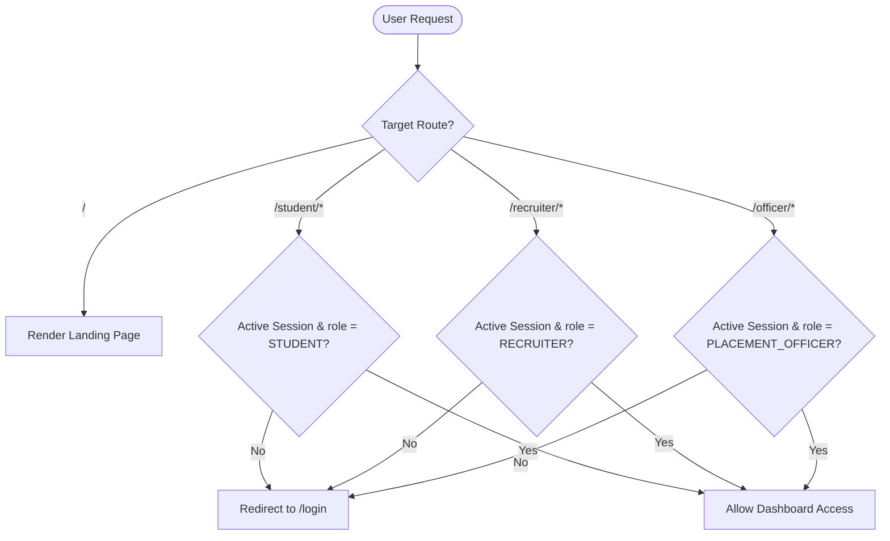
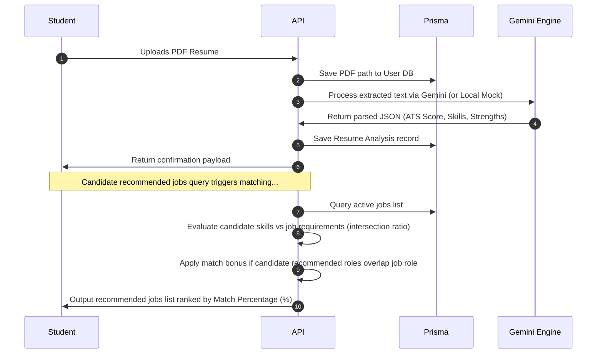
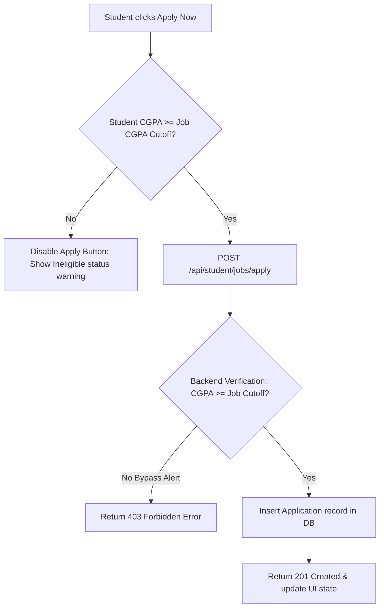
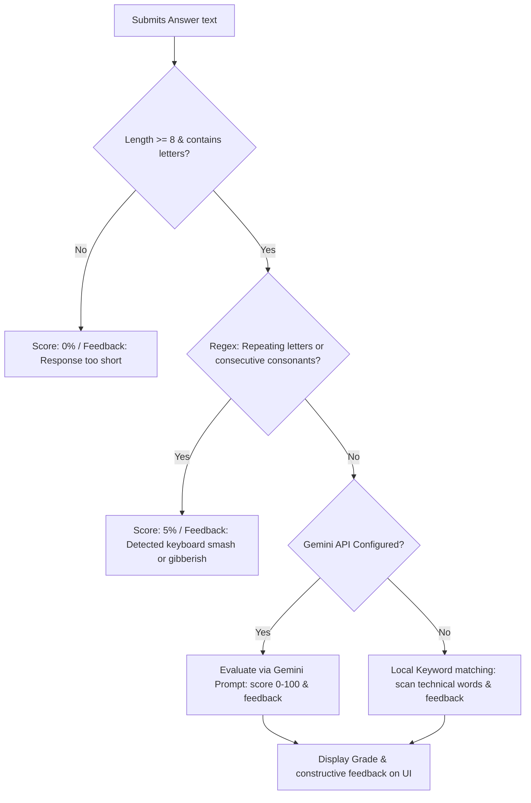
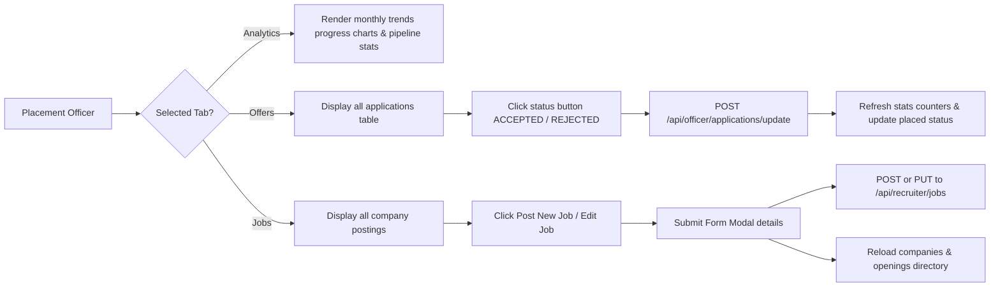

# PlacementAI 🚀

PlacementAI is a production-grade, AI-Powered Placement Management Platform designed for Student resume auditing, Recruiter job matching, and Placement Officer campus operations tracking.

Developed for Product Development Simulation benchmarks, it leverages generative intelligence (Gemini) to grade ATS relevance, predict candidate match ratings, auto-compile customized practice interviews, validate student responses, and provide comprehensive dashboard command tools.

---

## 🛠️ Technology Stack
* **Frontend:** Next.js 16 (App Router), JavaScript (ESM/JSX), Tailwind CSS v4, Lucide Icons
* **Backend:** Next.js Serverless API Route Handlers
* **Database:** MongoDB with Prisma ORM
* **Authentication:** NextAuth.js (Role-Based JWT Credentials Sessions)
* **AI Engine:** Google Gemini Pro API (`@google/generative-ai`)

---

## 📊 Requirements Analysis

### 1. Functional Scope by Role
* **Student Portal:**
  * PDF resume file uploading, local caching, and automated text parsing.
  * Interactive ATS Profile evaluation: computes score index, extracts key technical skills, details strengths/weaknesses, and maps missing requirements.
  * Real-time job recommendation grid: ranks jobs dynamically based on candidate compatibility, showing missing skills and CGPA cutoff warnings.
  * Academic eligibility checks: bars students from applying to openings if their academic CGPA is below the specified job threshold.
  * Practice Mock Interviews: generates 5 Technical, 3 Behavioral, and 2 Project questions tailored to the student's CV skills with randomization.
  * Practice grading engine: performs pre-validation (checks for short inputs or key-smash gibberish) and evaluates responses via live AI feedback and grades (0-100%).
* **Recruiter Console:**
  * Job Openings CRUD: enables recruiters to post, update, and delete active job descriptions.
  * Compatibility Matching Engine: queries student pools, evaluates profiles, and displays candidates ranked by match score.
  * Recruitment invites: sends invitations to shortlisted candidates.
* **Placement Officer Hub:**
  * Analytics Command Center: calculates campus KPIs (eligible students, placements rates, monthly trends, and pipeline ratios).
  * Student Offers Management: filters all student job submissions and updates offer statuses (Accept/Place, Shortlist, Review, Reject) dynamically.
  * Corporate CRUD operations: allows officers to create, edit, or delete job listings under any company to manage placements.

### 2. Constraints & Edge Cases
* **Database Limitations:** Prisma ORM on MongoDB requires connection strings configured with replica sets (e.g. MongoDB Atlas free tier or local replication via `rs.initiate()`) to support transactional operations like `upsert` and cascading deletes.
* **API Fail-Safes:** Includes high-fidelity local simulator fallbacks for all AI services (resume parsing, matching, questions compilation, grading) if the `GEMINI_API_KEY` environment variable is missing or fails.
* **Answer Validation Heuristics:** Employs regex patterns (`/([a-z])\1{3,}|[bcdfghjklmnpqrstvwxyz]{6,}/i`) to detect keyboard smash inputs or gibberish answers, rejecting them with a 5% score to prevent mock practice exploitation.

### 3. Styling & UX Design Rules
* **Glassmorphism Theme:** Consistently styled dark-mode layouts utilizing Zinc backgrounds (`#09090B`), Card surfaces (`#18181B`), Indigo accents (`#6366F1`), and high-readability text (`#FAFAFA`).
* **Visual Data Presentation:** Pure-CSS layouts for statistics cards, department ratios progress indicators, monthly vertical trend bars, and status badges.
* **Fluid Layouts:** Flex and Grid column systems that adapt seamlessly from mobile devices to desktop monitors.

---

## 🔄 System Workflows

### 1. User Authentication & Security Middleware


### 2. Resume Parsing & Job Matching Workflow


### 3. Job Application Eligibility & CGPA Cutoffs


### 4. Practice Mock Interview Answer Grading


### 5. Placement Officer Operations Command


---

## 📂 Project Directory Structure
```
PlacementAI/
├── prisma/
│   ├── schema.prisma   # Prisma ORM Database Models mapping to MongoDB
│   └── seed.js         # Seed script containing mock candidates, recruiters, and jobs
├── public/
│   └── uploads/        # Local upload folder for pdf resume files
├── src/
│   ├── app/
│   │   ├── (auth)/     # Authentication Layout & Pages
│   │   │   ├── login/
│   │   │   │   └── page.jsx    # Glassmorphic Login interface with role switcher
│   │   │   └── register/
│   │   │       └── page.jsx    # User registration screen
│   │   ├── api/        # Serverless API routes
│   │   │   ├── admin/
│   │   │   │   └── seed/
│   │   │   │       └── route.js    # DB Seeding trigger endpoint
│   │   │   ├── auth/
│   │   │   │   ├── [...nextauth]/
│   │   │   │   │   └── route.js    # NextAuth Credentials security config init
│   │   │   │   └── register/
│   │   │   │       └── route.js    # Password hashing and account creation
│   │   │   ├── officer/
│   │   │   │   ├── analytics/
│   │   │   │   │   └── route.js    # Compiles KPI metrics, trends, and directories
│   │   │   │   └── applications/
│   │   │   │       └── update/
│   │   │   │           └── route.js # Status update handler for student applications
│   │   │   ├── recruiter/
│   │   │   │   ├── candidates/
│   │   │   │   │   └── route.js    # Evaluates and ranks candidates against jobs
│   │   │   │   └── jobs/
│   │   │   │       ├── [id]/
│   │   │   │       │   └── route.js # PUT/DELETE job endpoint (Recruiter/Officer)
│   │   │   │       └── route.js    # GET/POST job endpoint (Recruiter/Officer)
│   │   │   └── student/
│   │   │       ├── dashboard-info/
│   │   │       │   └── route.js    # Fetches resume profile & eligible recommended jobs
│   │   │       ├── interview/
│   │   │       │   ├── generate/
│   │   │       │   │   └── route.js # Generates randomized practice interview questions
│   │   │       │   └── grade/
│   │   │       │       └── route.js  # Runs validation check & grades student mock answers
│   │   │       ├── jobs/
│   │   │       │   └── apply/
│   │   │       │       └── route.js # Creates job applications after eligibility checks
│   │   │       └── resume/
│   │   │           └── upload/
│   │   │               └── route.js # PDF uploader & parser calling Gemini service
│   │   ├── officer/
│   │   │   └── dashboard/
│   │   │       └── page.jsx    # Placement Officer operations dashboard console
│   │   ├── recruiter/
│   │   │   └── dashboard/
│   │   │       └── page.jsx    # Recruiter candidate tracking & job posting workspace
│   │   ├── student/
│   │   │   └── dashboard/
│   │   │       └── page.jsx    # Student CV analysis & practice panel portal
│   │   ├── globals.css # Custom styling variables and Tailwind v4 theme configuration
│   │   ├── layout.jsx  # Root wrapper layout configuring fonts, classes, and Providers
│   │   ├── page.jsx    # Custom marketing landing page
│   │   └── middleware.js # NextAuth Route protection filters
│   ├── components/
│   │   ├── ui/
│   │   │   └── Card.jsx        # Glassmorphic UI Card surface component
│   │   ├── Providers.jsx     # Auth Session context provider wrapper
│   │   └── Sidebar.jsx       # Shared responsive left sidebar component
│   └── lib/
│       ├── auth.js     # NextAuth credentials handler & session configs
│       ├── gemini.js   # Generative AI client engine and local simulator
│       ├── prisma.js   # Database client instantiation singleton
│       └── utils.js    # Tailwind styling merger helper
├── jsconfig.json       # Path alias mappings
├── next.config.mjs     # Next.js bundler config
├── package.json        # Node script dependencies
└── README.md           # Platform documentation
```

---

## 🔑 Simulation Test Credentials
All accounts are seeded with the default password: **`password123`**

| Role | Email Login | Description |
| :--- | :--- | :--- |
| **Placement Officer** | `officer@placementai.com` | Full administrative control over student offers, companies, and jobs. |
| **Recruiter** | `recruiter.google@placementai.com` | Create jobs (with CGPA cutoffs), edit details, and check AI student matching. |
| **Student** | `student.rahul.sharma@placementai.com` | Upload resumes, check ATS feedback, filter recommendations, check CGPA cutoff eligibility, and practice questions. |

---

*Architected & engineered by Arnav Garg. Version 1.1.0.*
